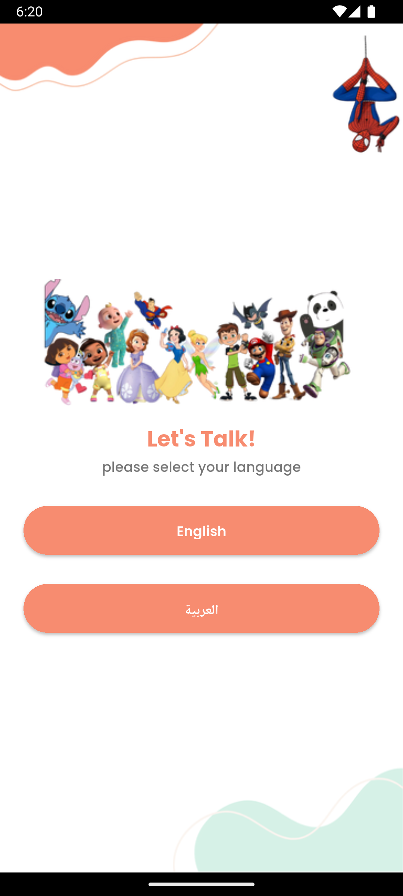
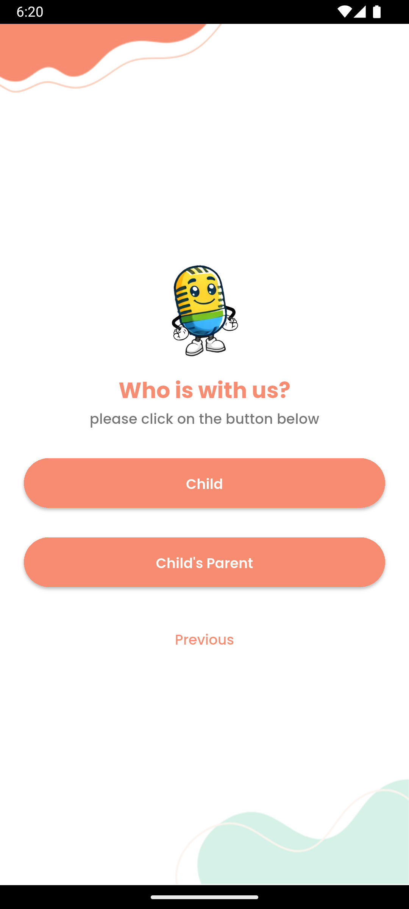
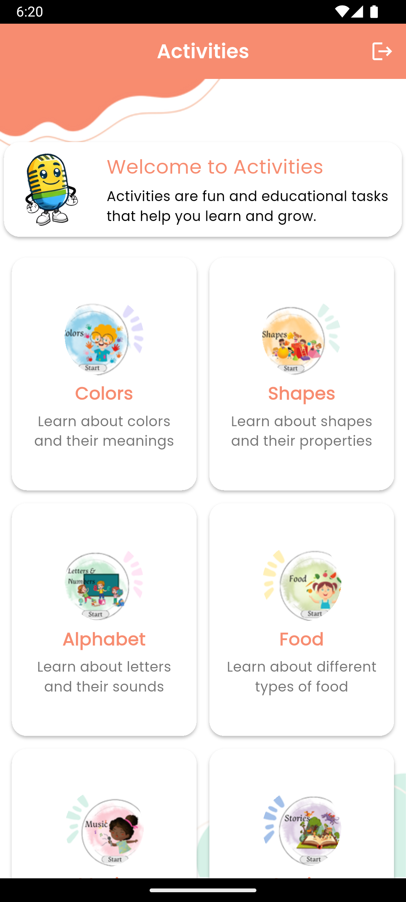
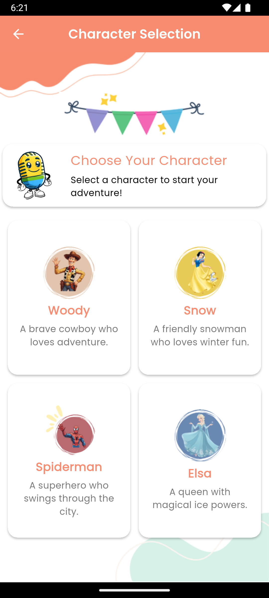
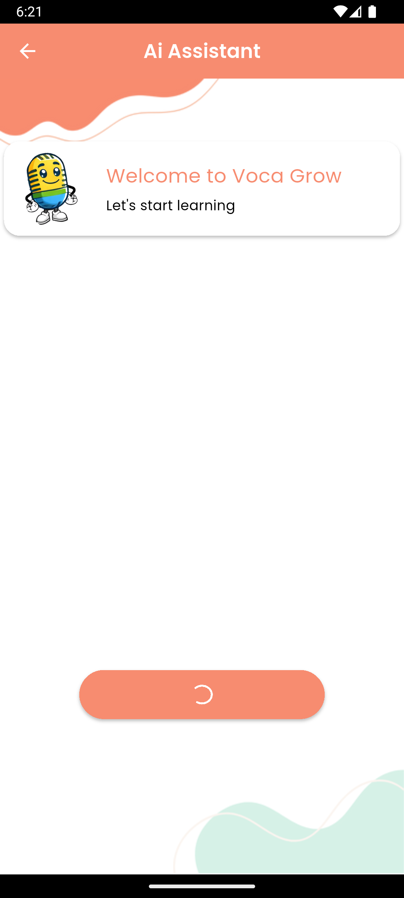
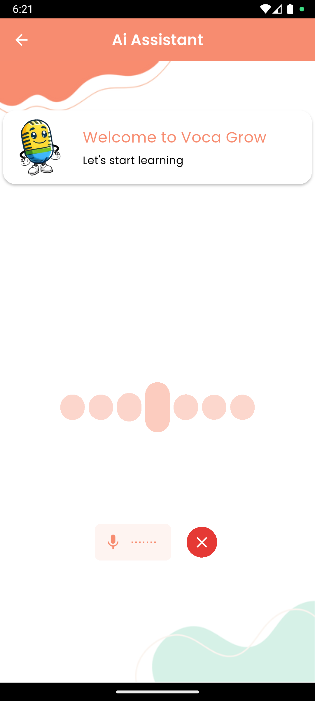
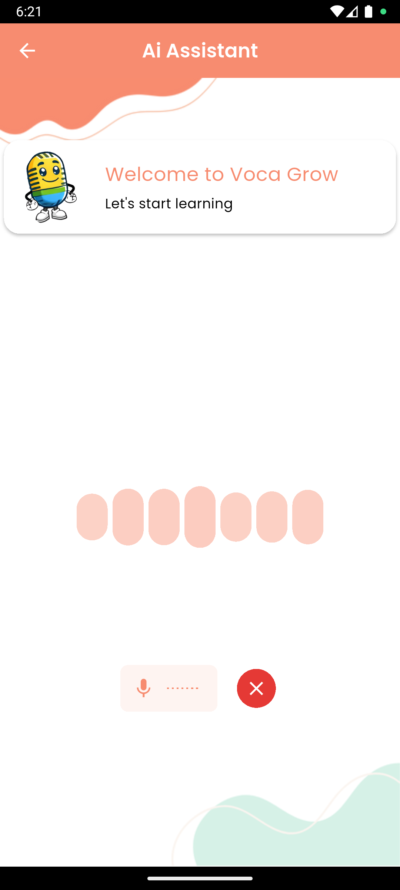
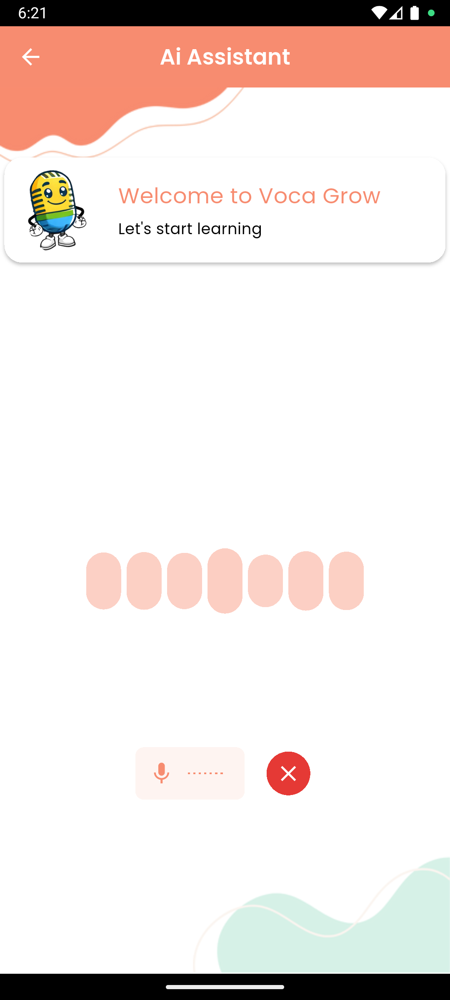

# VocaGrow App

VocaGrow is an intelligent mobile application built with Flutter that empowers children to practice pronunciation and language skills through AI-driven voice interaction. The project is developed following a highly organized, scalable, and modular architecture.

## Requirements
Create a `.env` file based on `.env.example`:

```plaintext
LIVEKIT_SANDBOX_ID=YOUR_LIVEKIT_SANDBOX_ID_HERE
```

## Screenshots

<table>
  <tr>
    <td></td>
    <td></td>
    <td></td>
    <td></td>
  </tr>
  <tr>
    <td></td>
    <td></td>
    <td></td>
    <td></td>
  </tr>
</table>
